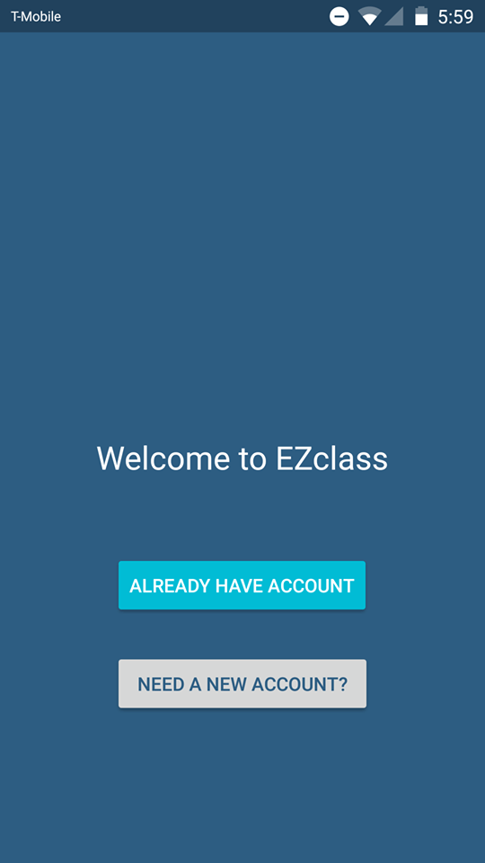
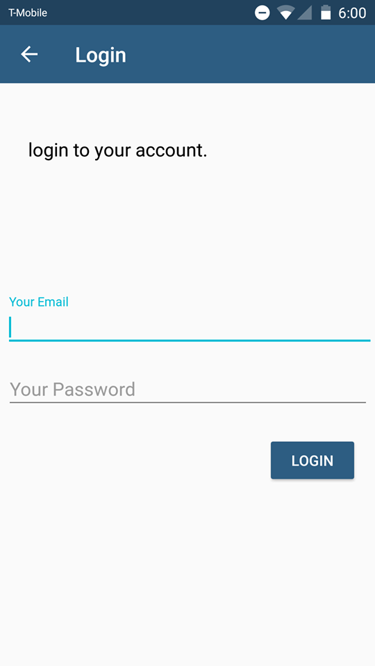
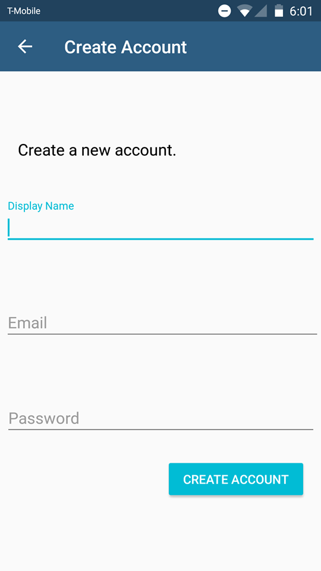
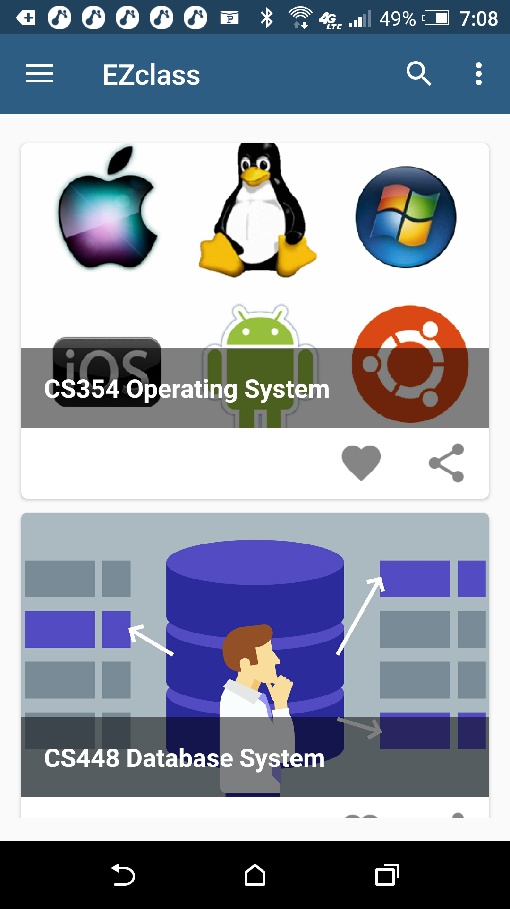
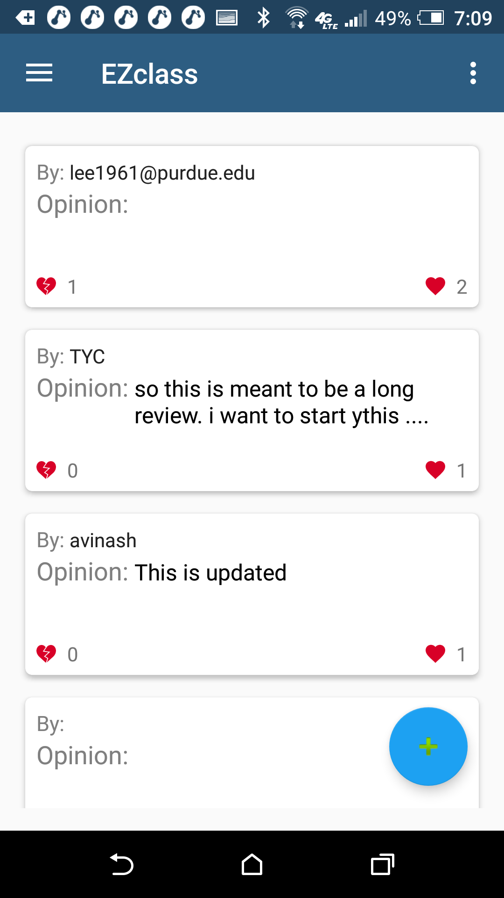
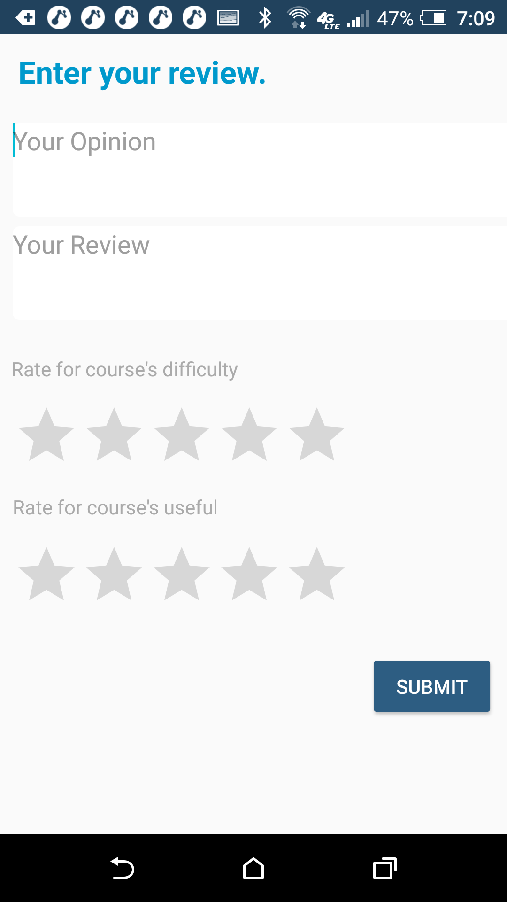

# DOCUMENTATION
## EZClassApp

## DESCRIPTION
Students who have not taken a class before and have no idea how hard or how to succeed in the class can use this this Android app to gain more insight about a class.

## Instruction
If you want to downloadm, you can download at 

## START PAGE

## Login Page

## Create an Account Page
This is where you create an account.

## Main Page
This is where after you have logged in or register an account, the this will be the main page where you can search for the classes you want.

## List of Review Page
This is where after clicking the class that you are interested in from the main page, you can see the list of reviews sorted by number of upvotes.

## Submit form Review Page
This is where if you click the floating action button from the list of review page, you can submit a review here.

## CONTACT
If you would like the apk file, you can contact me at lee1961@purdue.edu
